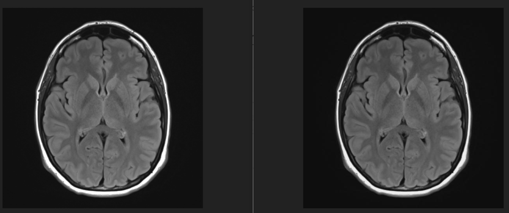
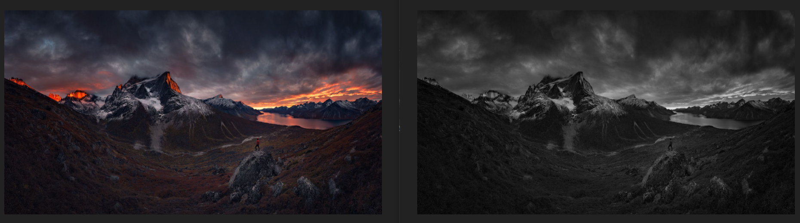
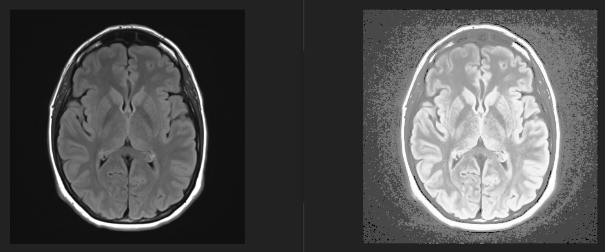
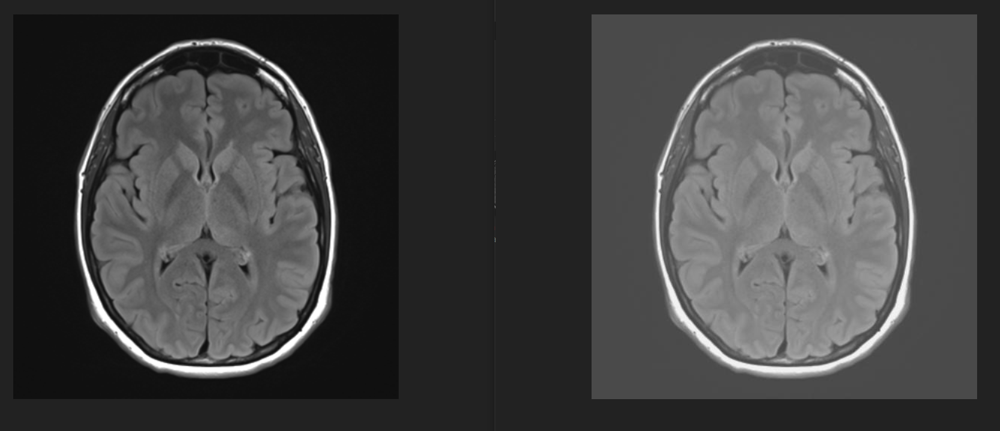
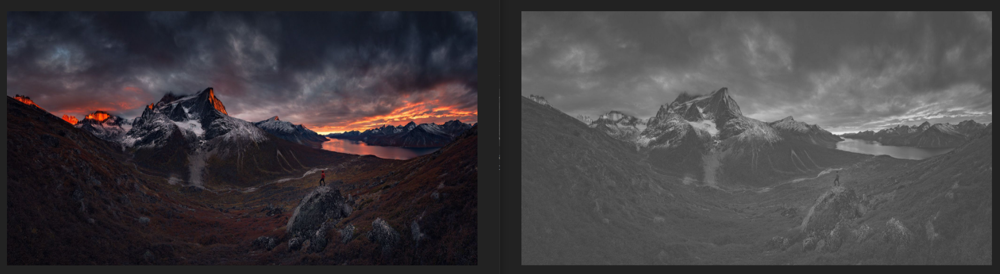
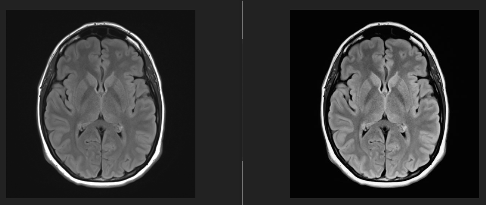
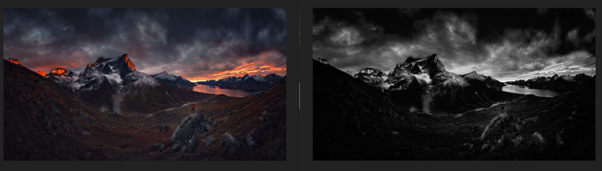

# 图像处理与模式识别

## 1 任务描述

- 打开一幅图像，进行直方图均衡。将其灰度线性变换，将其灰度拉伸。
- 使用 $C$ 语言或 $Java$ 编程。

## 2 算法原理

### 2.1 灰度图像

按照图像亮度等级分类，图像可分为二值图像和灰度图像。

- 二值图像：只有黑、白两种亮度等级的图像。
- 灰度图像：有多种亮度等级的图像。

灰度图像是指只有亮度差别，而没有颜色差别的图像，例如拍摄的黑白照片。又如，将一幅彩色图像分解成三幅分别为红、绿、蓝三色的灰度图像，每幅图像实际上看起来是没有颜色变化的，只有亮度变化。当然，也可将一幅彩色图像转换为灰度图像，用 $Y$ 代表亮度大小，则其转换式如下所示：

$$Y=0.229R+0.587G+0.114B$$

### 2.2 直方图均衡

直方图均衡化是一种最常用的直方图修正方法，这种方法的思想是把原始图像的直方图变换为均匀分布的形式，增加像素灰度值的动态范围。也就是说直方图均衡化是使原图像中具有相近灰度且占有大量像素点的区域指灰度范围展宽，使大区域中的微小灰度变化显现出来，增强图像整体对比度效果，使图像更清晰。

对于数字图像，在离散情况下，其灰度 $r_k$ 出现的概率可表示为：

$$P_r(r_k)=\frac{n_k}{n},\ 0≤r_k≤1,\ k=0,1,···，L-1$$

其中：

- $L$ 是灰度级的总数目
- $P_r(r_k)$ 是第 $k$ 级灰度值的概率
- $n_k$ 是图像中出现第 $k$ 级灰度值的次数
- $n$ 是图像中的像素总数。

图像灰度变换函数可表示为：

$$s_k=T[r_k]= \sum_{j=0}^k\frac{n_j}{n}=\sum_{j=0}^kP_r(r_k)$$

相应的反变换式为：

$$r_k=T^{-1}[s_k]$$

### 2.3 灰度线性变换

图像的灰度变换除了是图像增强处理技术中一种非常基础、直接的空间域图像处理方法。灰度变换是指根据某种目标条件按一定变换关系逐像素点改变原图像中灰度值的方法，该变换可使图像动态范围增大，对比度得到扩展，图像变得更加清晰，特征明显，是图像增强的重要手段之一。

假定原图像 $f(x,y)$ 的灰度范围为 $[a,b]$，经过线性变换后，输出图像的灰度范围为 $[c,d]$，则该线性变换可表示为：

$$g(x,y)=\frac{d-c}{b-a}[f(x,y)-a]+c$$ 

根据线性变换的原理，图像可拉伸至任意的灰度范围内。灰度拉伸的范围越小，像素见的灰度值越相近，图像的表现力越差。灰度拉伸的范围越大，像素见的灰度值差异越大，图像能够表现的细节信息越多。

### 2.4 灰度拉伸

灰度拉伸是扩展图像灰度级动态范围的处理，使用的是最简单的分段线性变换函数，它可以跨越记录介质和显示装置的全部灰度范围.

如果数字图像的灰度范围为 $0—M$，但是大部分像素的灰度值落在 $[a,b]$ 内，只有很小部分像素的灰度值不在该区域内，用上式一般不能得到较好的视觉效果，为了改善增强的效果，可用分段线性灰度变换进行增强：

$$g(x,y)=\begin{cases} c & 0≤f(x,y)<a \\ \frac{d-c}{b-a}[f(x,y)-a]+c & a≤f(x,y)<b \\ d & b ≤f(x,y)≤M\end{cases}$$

如果数字图像的灰度范围为 $0—M$，感兴趣的灰度区间为 $[a,b]$，为了使该区间的信息增强，抑制其他区间的图像信息，可采用如下分段线性灰度变换：

$$g(x,y)=\begin{cases} \frac{c}{a}f(x,y) & 0≤f(x,y)<a \\ \frac{d-c}{b-a}[f(x,y)-a]+c & a≤f(x,y)<b \\ \frac{e-d}{M-b}[f(x,y)-b]+d & b ≤f(x,y)≤M\end{cases}$$

## 3 代码实现

### 3.1 实现环境

#### 3.1.1 使用语言

$Java$

#### 3.1.2 编译环境

$jdk\ 1.8.0\_101$

#### 3.1.3 目录结构

```
Image-Processing/
├── src
│   ├── Main.java
│   ├── GreyProcessor.java
│   ├── HistogramEqualizer.java
│   └── LinearTransformer.java
├── image
│   ├── brain.jpg
│   ├── grey_brain.jpg
│   ├── equalization_brain.jpg
│   ├── linear_transform_brain.jpg
│   ├── linear_stretch_brain.jpg
│   ├── view.jpg
│   ├── grey_view.jpg
│   ├── equalization_view.jpg
│   ├── linear_transform_view.jpg
│   └── linear_stretch_view.jpg
└── README.md
```

### 3.2 图像灰度化

```java
for (int i = 0; i < this.width; i++) {
    for (int j = 0; j < this.height; j++) {
        int argb = image.getRGB(i, j);
        int a = (argb >> 24) & 0xff;
        int r = (argb >> 16) & 0xff;
        int g = (argb >> 8) & 0xff;
        int b = (argb) & 0xff;
        int grey = (int) (0.229 * r + 0.587 * g + 0.114 * b);
        argb = (a << 24) | (grey << 16) | (grey << 8) | grey;
        this.greyImage.setRGB(i, j, argb);
    }
}
```

### 3.3 直方图均衡

首先统计灰度级频次。

```java
for (int i = 0; i < this.width; i++) {
	for (int j = 0; j < this.height; j++) {
		int grey = this.greyPixels[this.height * i + j] & 0xff;
		greyFrequency[grey]++;
	}
}
```

接着运用灰度变换函数 $s_k=\sum_{j=0}^k\frac{n_j}{n}$ 进行计算。

```java
for (int i = 0; i < 256; i++) {
    p[i] = (double) greyFrequency[i] / sum;

    if (i > 0) {
        s[i] = s[i - 1] + p[i];
    } else {
        s[i] = p[i];
    }
}

for (int i = 0; i < 256; i++) {
    s[i] *= 255;
}
```

最后进行反变换 $r_k=T^{-1}[s_k]$

```java
for (int i = 0; i < this.width; i++) {
	for (int j = 0; j < this.height; j++) {
		int index = this.height * i + j;
        int level = (int) s[this.greyPixels[index] & 0xff];
        equalizationPixels[index] = level << 16 | level << 8 | level;
        equalizationImage.setRGB(i, j, equalizationPixels[index]);
	}
}
```

### 3.4 灰度线性变换

直接利用变换函数 $g(x,y)=\frac{d-c}{b-a}[f(x,y)-a]+c$

```java
for (int i = 0; i < this.width; i++) {
    for (int j = 0; j < this.height; j++) {
        int grey = this.greyPixels[this.height * i + j] & 0xff;
        grey = (int) (k * (grey - a) + c);
        grey = grey << 16 | grey << 8 | grey;
        this.linearTransformImage.setRGB(i, j, grey);
    }
}
```

### 3.5 灰度拉伸

采用如下分段线性灰度变换：

$$g(x,y)=\begin{cases} \frac{c}{a}f(x,y) & 0≤f(x,y)<a \\ \frac{d-c}{b-a}[f(x,y)-a]+c & a≤f(x,y)<b \\ \frac{e-d}{M-b}[f(x,y)-b]+d & b ≤f(x,y)≤M\end{cases}$$

```java
for (int i = 0; i < this.width; i++) {
    for (int j = 0; j < this.height; j++) {
        int grey = this.greyPixels[this.height * i + j] & 0xff;

        if (grey < a) {
            grey = (int) (k1 * grey);
        } else if (grey < b) {
            grey = (int) (k2 * (grey - a) + c);
        } else {
            grey = (int) (k3 * (grey - b) + d);
        }

        grey = grey << 16 | grey << 8 | grey;
        this.linearStretchImage.setRGB(i, j, grey);
    }
}
```

## 4 实验结果

这次实验选取了两种图像，一种是大脑影像 $CT$，一种是风景摄影。

通过对大脑影像的图像增强，可以放大病变部位，辅助医生判断。

通过对风景摄影的图像变换，可以获得不同角度的风格摄影。

### 4.1 图像灰度化





由于大脑影像本身就是灰度图像，图像灰度化后没有明显变化。

风景摄影中，图像灰度化将原本的彩色图像变为了只有亮度差别，而没有颜色差别的图像，可以达到后期黑白摄影的处理。

### 4.2 直方图均衡




无论是大脑影像还是风景摄影，直方图均衡都使得微小的灰度变化显现出来，增强了整体的对比度效果，使图像更清晰，方便观察细节。

### 4.3 灰度线性变换





灰度线性变换可让我们选定观察区间，去除我们不需要的灰度范围，这种变换使得图像能动态增强某一范围，但是效果并不显著。

### 4.4 灰度拉伸





灰度拉伸是扩展图像灰度级动态范围的处理，我所使用的分段线性变换函数是第二种，并没有丢弃任一区域，而是增强了我们所需要的图像信息，抑制其他区间的图像信息，效果明显。

### 4.5 对比结果

从本次实验的图像上，可以直观看出，直方图均衡和灰度拉伸的效果相对来说是比较出色的。