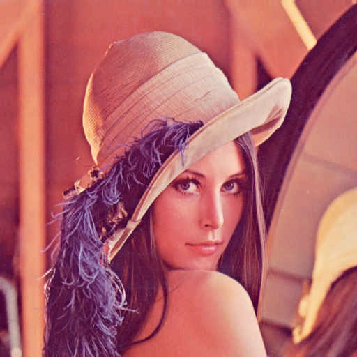
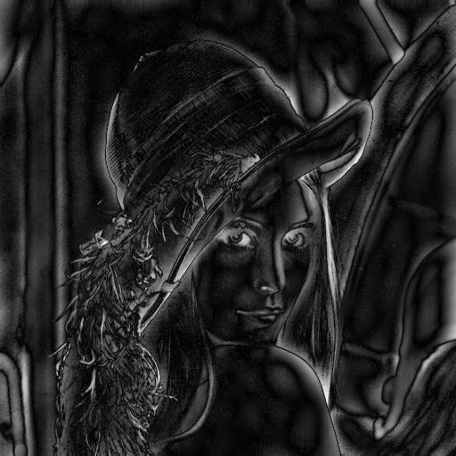

# 图像处理与模式识别

## 1 任务描述

- 将 LENA 图像用 JPEG 方式压缩。
- 将 LENA 图像用两种以上方法进行边缘提取，并分析比较结果。

## 2 实现环境

使用语言

- Python 3.7.3​

requirements.txt​：

```
numpy==1.16.1
opencv-python==4.1.1.26
```

## 3 目标图像

本次作业使用的是标准的 Lena 图像：

 <center class="half">
 	
</center> 

## 4 JPEG 压缩

### 4.1 任务

将 LENA 图像用 JPEG 方式压缩。

### 4.2 算法原理

将图像转为 YCbCr 色彩空间之后，进行离散余弦变换，再对 Y 用 Q1 量化矩阵量化，Cb 和 Cr 用 Q2 量化矩阵量化。最后通过离散余弦逆变换对图像复原。

算法如下：

1. 将图像从 RGB 色彩空间变换到 YCbCr 色彩空间；
2. 对 YCbCr 做 DCT；
3. DCT 之后做量化；
4. 量化之后应用 IDCT；
5. IDCT 之后从 YCbCr 色彩空间变换到 RGB 色彩空间。

#### 4.2.1 YCbCr

RGB 色彩空间和 YCbCr 色彩空间的变换式为：
$$
Y = 0.257*R+0.504*G+0.098*B+16\\Cb = -0.148*R-0.291*G+0.439*B+128\\Cr = 0.439*R-0.368*G-0.071*B+128\\R = 1.164*(Y-16)+1.596*(Cr-128)\\G = 1.164*(Y-16)-0.392*(Cb-128)-0.813*(Cr-128)\\B = 1.164*(Y-16)+2.017*(Cb-128)\\
$$

#### 4.2.2 DCT

信号学中，如果一个信号长度为 8 字节，则可以用 8 个不同频率的余弦波去表示它，形成频域编码，在图像中也是如此。

在 JPEG 算法中，图像被分为了 8\*8 的像素组，每个像素组用自己的离散余弦变化进行频域编码（如果采用比 8\*8 更大的像素组，会大幅增加 DCT 的运算量，且编码质量也不会明显提升；采用比 8\*8 更小的像素组会导致分组增多降低精度，所以8\*8 的像素组是效率最优的结果）。

这些像素组可以被 8*8 个余弦波精确表示，如下图所示有 64 个基本余弦波：

 <center class="half">
 	
</center> 

这64个余弦波，可以组合成任意 8\*8 的图形。我们只要用系数（系数表示每个单独的余弦波对整体图像所做的贡献）对这64个余弦波进行加权，就可以表示出任何的图形。

离散余弦变换的变换式为：
$$
F(u,v)=\frac{2}{\sqrt{MN}}\  \sum\limits_{x=0}^{M-1}\ \sum\limits_{y=0}^{N-1}\ f(x,y)\  C(u)\  C(v)\ \cos(\frac{(2\  x+1)\  u\  \pi}{2\  M})\ \cos(\frac{(2\  y+1)\  v\  \pi}{2\  N})\\C(u)=\begin{cases}\frac{1}{\sqrt{2}}& u=0\\1&\text{其他}\end{cases}
$$
离散余弦逆变换使用下式定义：

$$
f(x,y)=\frac{2}{\sqrt{MN}}\  \sum\limits_{u=0}^{M-1}\ \sum\limits_{v=0}^{N-1}\ C(u)\  C(v)\ F(u,v)\ \cos(\frac{(2\  x+1)\  u\  \pi}{2\  M})\ \cos(\frac{(2\  y+1)\  v\  \pi}{2\  N})\\C(u)=\begin{cases}\frac{1}{\sqrt{2}}& u=0\\1&\text{其他}\end{cases}
$$

#### 4.2.3 量化

在 DCT 变化后，舍弃高频区数据的过程称为量化。有两份量化表可供选择，分别为亮度量化表和色度量化表：

![[公式]](https://www.zhihu.com/equation?tex=Q_%7BY%7D%3D%7B%5Cbegin%7Bbmatrix%7D16%2611%2610%2616%2624%2640%2651%2661%5C%5C12%2612%2614%2619%2626%2658%2660%2655%5C%5C14%2613%2616%2624%2640%2657%2669%2656%5C%5C14%2617%2622%2629%2651%2687%2680%2662%5C%5C18%2622%2637%2656%2668%26109%26103%2677%5C%5C24%2635%2655%2664%2681%26104%26113%2692%5C%5C49%2664%2678%2687%26103%26121%26120%26101%5C%5C72%2692%2695%2698%26112%26100%26103%2699%5Cend%7Bbmatrix%7D%7D+Q_%7BC%7D%3D%7B%5Cbegin%7Bbmatrix%7D17%2618%2624%2647%2699%2699%2699%2699%5C%5C18%2621%2626%2666%2699%2699%2699%2699%5C%5C24%2626%2656%2699%2699%2699%2699%2699%5C%5C47%2666%2699%2699%2699%2699%2699%2699%5C%5C99%2699%2699%2699%2699%2699%2699%2699%5C%5C99%2699%2699%2699%2699%2699%2699%2699%5C%5C99%2699%2699%2699%2699%2699%2699%2699%5C%5C99%2699%2699%2699%2699%2699%2699%2699%5Cend%7Bbmatrix%7D%7D)

上表分别为亮度量化表和色彩量化表，表示 50% 的图像质量。这两张表中的数据基于人眼对不同频率的敏感程度制定。

量化表是控制 JPEG 压缩比的关键，可以根据输出图片的质量来自定义量化表，通常自定义量化表与标准量化表呈比例关系，表中数字越大则质量越低，压缩率越高。

量化过程为，使用量化矩阵与前面得到的 DCT 矩阵逐项相除并取整。这里对 Y 用 Qy 量化矩阵量化，Cb 和 Cr 用 Qc 量化矩阵量化。

量化是有损的，在解码时，反量化会乘回量化表的相应值。由于存在取整，低频段会有所损失，高频段的 0 字段则会被舍弃，最终导致图像质量降低。

### 4.3 代码实现

将图像从 RGB 色彩空间变换到 YCbCr 色彩空间：

```python
def BGR_to_YCbCr(img):
    height, width, channel = img.shape
    YCbCr = np.zeros([height, width, channel], dtype=np.float32)
    YCbCr[..., 0] = 0.257 * img[..., 2] + 0.504 * img[..., 1] + 0.098 * img[..., 0] + 16
    YCbCr[..., 1] = -0.148 * img[..., 2] - 0.291 * img[..., 1] + 0.439 * img[..., 0] + 128.
    YCbCr[..., 2] = 0.439 * img[..., 2] - 0.368 * img[..., 1] - 0.071 * img[..., 0] + 128.
    return YCbCr
```

对 YCbCr 做 DCT：

```python
def dct(img, T=8):
    height, width, channel = img.shape
    F = np.zeros((height, width, channel), dtype=np.float32)

    for c in range(channel):
        for yi in range(0, height, T):
            for xi in range(0, width, T):
                for v in range(T):
                    for u in range(T):
                        for y in range(T):
                            for x in range(T):
                                F[v + yi, u + xi, c] += img[y + yi, x + xi, c] * cos_core(x, y, u, v, T)
    return F
```

DCT 之后做量化：

```python
def quantization(F, T=8):
    Qy = np.array(((16, 11, 10, 16, 24, 40, 51, 61),
                   (12, 12, 14, 19, 26, 58, 60, 55),
                   (14, 13, 16, 24, 40, 57, 69, 56),
                   (14, 17, 22, 29, 51, 87, 80, 62),
                   (18, 22, 37, 56, 68, 109, 103, 77),
                   (24, 35, 55, 64, 81, 104, 113, 92),
                   (49, 64, 78, 87, 103, 121, 120, 101),
                   (72, 92, 95, 98, 112, 100, 103, 99)), dtype=np.float32)
    Qc = np.array(((17, 18, 24, 47, 99, 99, 99, 99),
                   (18, 21, 26, 66, 99, 99, 99, 99),
                   (24, 26, 56, 99, 99, 99, 99, 99),
                   (47, 66, 99, 99, 99, 99, 99, 99),
                   (99, 99, 99, 99, 99, 99, 99, 99),
                   (99, 99, 99, 99, 99, 99, 99, 99),
                   (99, 99, 99, 99, 99, 99, 99, 99),
                   (99, 99, 99, 99, 99, 99, 99, 99)), dtype=np.float32)

    height, width, channel = F.shape
    for yi in range(0, height, T):
        for xi in range(0, width, T):
            F[yi: yi + T, xi: xi + T, 0] = np.round(F[yi: yi + T, xi: xi + T, 0] / Qy) * Qy
            F[yi: yi + T, xi: xi + T, 1] = np.round(F[yi: yi + T, xi: xi + T, 1] / Qc) * Qc
            F[yi: yi + T, xi: xi + T, 2] = np.round(F[yi: yi + T, xi: xi + T, 2] / Qc) * Qc
    return F
```

量化之后应用 IDCT：

```python
def idct(F, T=8, K=8):
    height, width, channel = F.shape
    out = np.zeros((height, width, channel), dtype=np.float32)

    for c in range(channel):
        for yi in range(0, height, T):
            for xi in range(0, width, T):
                for y in range(T):
                    for x in range(T):
                        for v in range(K):
                            for u in range(K):
                                out[y + yi, x + xi, c] += F[v + yi, u + xi, c] * cos_core(x, y, u, v, T)
    return np.round(np.clip(out, 0, 255)).astype(np.uint8)
```

IDCT 后从 YCbCr 色彩空间变换到 RGB 色彩空间：

```python
def YCbCr_to_BGR(img):
    height, width, channel = img.shape
    BGR = np.zeros([height, width, channel], dtype=np.float32)
    BGR[..., 2] = 1.164 * (img[..., 0] - 16) + 1.596 * (img[..., 2] - 128.)
    BGR[..., 1] = 1.164 * (img[..., 0] - 16) - 0.392 * (img[..., 1] - 128.) - 0.813 * (img[..., 2] - 128.)
    BGR[..., 0] = 1.164 * (img[..., 0] - 16) + 2.017 * (img[..., 1] - 128.)
    return np.clip(BGR, 0, 255).astype(np.uint8)
```

### 4.4 实验结果

<center class="half">
    &nbsp
</center> 


原图大小为 768 KB，压缩后的图像大小为 60.1 KB，压缩率为 7.8%，效果很好。

## 5 边缘提取：Gabor 滤波

### 5.1 任务

使用 Gabor 滤波器进行边缘提取。

### 5.2 算法原理

在图像处理领域，以 Dennis Gabor 命名的 Gabor 滤波器，是一种结合了高斯分布和频率变换的滤波器，用于在图像的特定方向提取边缘。

滤波器由以下式子定义：
$$
G(y, x) = e^{-\frac{{x'}^2 + \gamma^2\ {y'}^2}{2\  \sigma^2}} \  \cos(\frac{2\ \pi\ x'}{\lambda} + p)\\
x'=\cos(A)\  x+\sin(A)\  y\\
y'=-\sin(A)\  x+\cos(A)\  y
$$
其中：

* $x$、$y$是滤波器的位置。滤波器的大小如果为$K$的话，$y$、$x$取$[-k//2,k//2]$；
* $\gamma$：空间宽高比，表示 Gabor 滤波器的椭圆度；
* $\sigma$：Gabor 过滤器中使用的高斯函数的标准差；
* $\lambda$：上述方程中正弦因子的波长，有效值应大于2，以像素为单位；
* $p$：相位偏移；
* $A$：Gabor 函数的平行条纹的法线方向，有效值为从0~360度的实数。

将图像灰度化之后，分别使用 $A=0,45,90,135$ 的 Gabor 滤波器进行滤波，提取指定方向上的边缘。

Gabor 滤波器提取了指定方向上的边缘。

一般认为 Gabor 滤波器接近生物大脑视皮层中的初级简单细胞（V1 区）。也就是说，当生物看见眼前的图像时也进行了特征提取。深度学习的卷积层接近 Gabor 滤波器的功能。

### 5.3 代码实现

将 RGB 图像变换为灰度图像：

```python
def BGR_to_GRAY(img):
    gray = 0.229 * img[..., 2] + 0.587 * img[..., 1] + 0.114 * img[..., 0]
    return gray.astype(np.uint8)
```

Gabor 滤波：

```python
def gabor_filtering(gray, K_size, Sigma, Gamma, Lambda, Psi, angle):
    height, width = gray.shape
    gray = np.pad(gray, (K_size // 2, K_size // 2), mode='edge')
    out = np.zeros((height, width), dtype=np.float32)

    d = K_size // 2
    filter = np.zeros((K_size, K_size), dtype=np.float32)
    for y in range(K_size):
        for x in range(K_size):
            A = angle / 180. * np.pi
            kernel_x = np.cos(A) * (x - d) + np.sin(A) * (y - d)
            kernel_y = -np.sin(A) * (x - d) + np.cos(A) * (y - d)
            filter[y, x] = np.exp(-(kernel_x ** 2 + (Gamma * kernel_y) ** 2) / (2 * Sigma ** 2)) * np.cos(
                2 * np.pi * kernel_x / Lambda + Psi)
    filter /= np.sum(np.abs(filter))

    for y in range(height):
        for x in range(width):
            out[y, x] = np.sum(gray[y: y + K_size, x: x + K_size] * filter)
    out = np.clip(out, 0, 255).astype(np.uint8)
    return out
```

将不同方向的提取特征叠加在一起，提取图像的边缘：

```python
def gabor_process(img):
    height, width, _ = img.shape
    gray = BGR_to_GRAY(img).astype(np.float32)
    A = [0, 45, 90, 135]
    out = np.zeros([height, width], dtype=np.float32)
    for a in A:
        out += gabor_filtering(gray, K_size=11, Sigma=1.6, Gamma=1.2, Lambda=3, Psi=0, angle=a)
    out = (out / out.max() * 255).astype(np.uint8)
    return out
```

### 5.4 实验结果

<center class="half">
    
</center> 

## 6 边缘提取：傅立叶变换高通滤波

### 6.1 任务

对图像使用离散二维傅里叶变换，并进行高通滤波，然后使用离散二维傅里叶逆变换将图形复原。

### 4.2 算法原理

傅里叶变换的物理意义是将图像的灰度分布变换为频率分布，而傅里叶的逆变换则是将图像的频率分布变换为灰度分布。

在处理实际问题时，信号往往都是离散的，例如图像就是一个二维离散信号，数字图像使用 $[0,255]$ 范围内的离散值表示，并且图像使用$M\times N$的二维矩阵表示，所以在这里使用离散二维傅里叶变换。因此，离散信号的傅里叶变换及其逆变换是非常具有现实意义的。

二维离散傅里叶变换使用下式计算，其中 $f$ 表示输入图像：
$$
F(u,v)=\sum\limits_{x=0}^{M-1}\ \sum\limits_{y=0}^{N-1}\ f(x,y)\ e^{-j\  2\  \pi\ (\frac{u\  x}{M}+\frac{v\  y}{N})}
$$
离散二维傅里叶逆变换按照下式定义：
$$
f(x,y)=\frac{1}{M\  N}\ \sum\limits_{u=0}^{M-1}\ \sum\limits_{v=0}^{N-1}\ F(u,v)\ e^{j\ 2\  \pi\ (\frac{u\  x}{M}+\frac{v\  y}{N})}
$$

通过离散傅立叶变换得到的频率在左上、右上、左下、右下等地方频率较低，在中心位置频率较高。

高频：

- 图像中灰度变化剧烈的点，一般是图像轮廓或者是噪声。

低频：

- 图像中平坦的，灰度变化不大的点，图像中的大部分区域。

高通滤波器：

- 只允许某一频率以上的信号无衰减地通过滤波器，去掉了信号中低于该频率的不必要的成分或者说去掉了低于该频率的干扰信号。

通过高通滤波，图像被过滤了低频，只保留那些变化最快速最剧烈的区域，也就是图像里面的物体边缘，所以常用于边缘识别。

理想的高通滤波器模板为：
$$
H(u,v)=\begin{cases}0 & D(u,v)≤0\\1 & D(u,v)≥0\end{cases}
$$
其中，D0 表示通带半径，D(u，v) 是到频谱中心的距离（欧式距离），计算公式如下：

 

M 和 N 表示频谱图像的大小，（M/2，N/2）即为频谱中心.

### 6.3 代码实现

将 RGB 图像变换为灰度图像：

```python
def BGR_to_GRAY(img):
    gray = 0.229 * img[..., 2] + 0.587 * img[..., 1] + 0.114 * img[..., 0]
    return gray.astype(np.uint8)
```

DFT：

```python
def dft(img):
    M, N = img.shape
    F = np.zeros((M, N), dtype=np.complex)
    X = np.tile(np.arange(N), (M, 1))
    Y = np.arange(M).repeat(N).reshape(M, -1)
    for u in range(M):
        for v in range(N):
            F[u, v] = np.sum(img * np.exp(-2j * np.pi * (u * X / M + v * Y / N)))
    return F
```

高通滤波：

```python
def hpk(r, c, D0, dftShift):
    dftShift[r - D0:r + D0, c - D0:c + D0] = 0
    ishift = np.fft.ifftshift(dftShift)
    iimage = cv2.idft(ishift)
    iimage = cv2.magnitude(iimage[:, :, 0], iimage[:, :, 1])
    return iimage


def hpf(img):
    gray = BGR_to_GRAY(img)
    dft = cv2.dft(np.float32(gray), flags=cv2.DFT_COMPLEX_OUTPUT)
    dftShift = np.fft.fftshift(dft)
    R, C = gray.shape
    r, c = int(R / 2), int(C / 2)
    out = hpk(r, c, 8, dftShift)
    out = (out / out.max() * 255).astype(np.uint8)
    return out
```

IDFT：

```python
def idft(F):
    M, N = F.shape
    f = np.zeros((M, N), dtype=np.float32)
    U = np.tile(np.arange(N), (M, 1))
    V = np.arange(M).repeat(N).reshape(M, -1)

    for x in range(M):
        for y in range(N):
            f[x, y] = np.abs(np.sum(F * np.exp(2j * np.pi * (x * U / M + y * V / N))))
    f = f / (M * N)
    return f
```

### 6.4 实验结果

<center class="half">
    
</center> 

## 7 两种边缘提取方法的比较

<center class="half">
    &nbsp
</center> 

相较于傅立叶变换高通滤波，Gabor 滤波的频率和方向表达与人类视觉系统更加类似，能够提供良好的方向选择和尺度选择特性，而且对于光照变化不敏感，因此效果更好。

